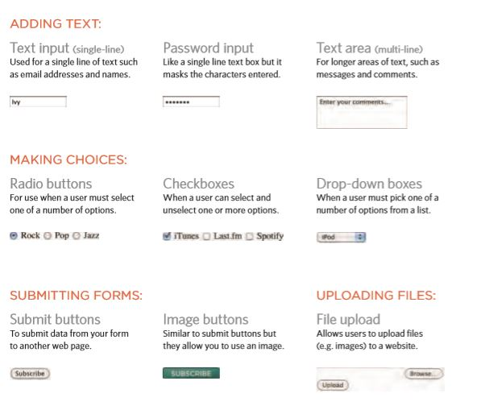

# Forms

The best known form on the web is probably the search box that sits right in the middle of Google's homepage  

In addition to enabling users to search, forms also allow users to perform other functions online. You will see forms 
when registering as a member of a website, when shopping online, and when signing up for newsletters or mailing lists.

  
* visitors you will need a form, which lives inside a <form> element.
* Information from a form is sent in name/value pairs.
* Each form control is given a name, and the text the user types in or the values of the options they select are sent to the server.
* HTML5 introduces new form elements which make it easier for visitors to fill in forms.
* List markers can be given different appearances using the list-style-type and list-style image properties.
* Table cells can have different borders and spacing in different browsers, but there are properties you can use to control them and make them more consistent. 
* Forms are easier to use if the form controls are vertically aligned using CSS.
* Forms benefit from styles that make them feel more interactive.
  
# Events
DIFFERENT EVENT TYPES 
Here is a selection of the events that occur in the browser while you are browsing the web. Any of these events can be used to trigger a function in your JavaScript code. 
UIEVENTS Occur when a user interacts with the browser's user interface (UI) rather than the web page 

* Events are the browser's way of indicating when something has happened (such as when a page has finished loading or a button has been clicked). 
* Binding is the process of stating which event you are waiting to happen, and which element you are waiting for that event to happen upon. 
* When an event occurs on an element, it can trigger a JavaScript function.
* When this function then changes the web page in some way, it feels interactive because it has responded to the user. 
* You can use event delegation to monitor for events that happen on all of the children of an element. 
* The most commonly used events are W3C DOM events, although there are others in the HTMLS specification as well as browser-specific events.