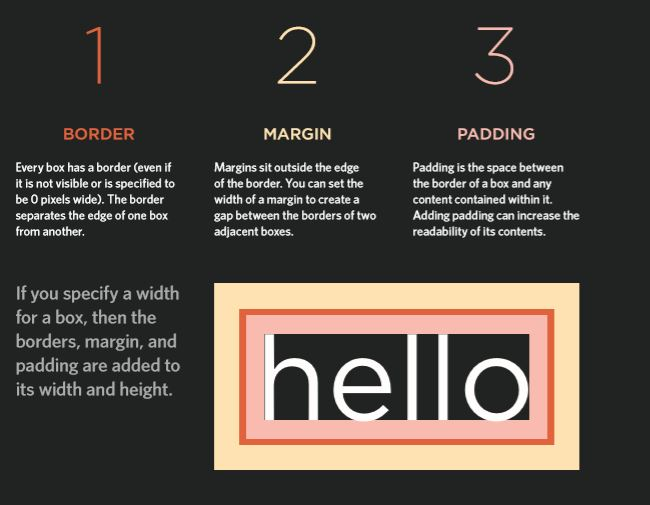
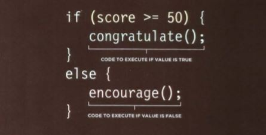
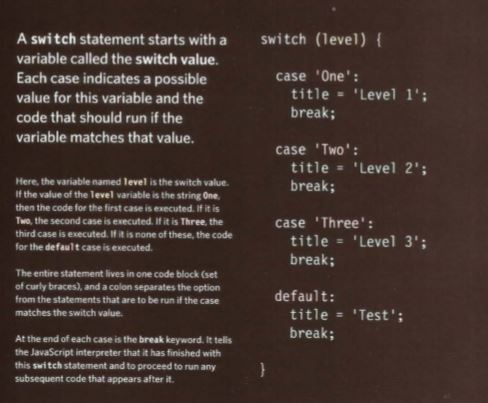

# Lists and Boxes
### Tupes of lists:
Ordered lists :are lists where each item in the list is numbered. For example, the list might be a set of steps for a recipe that must be performed in order, or a legal contract where each point needs to be identified by a section number. Unordered lists are lists that begin with a bullet point (rather than characters that indicate order).
Definition lists  are made up of a set of terms along with the definitions for each of those terms.

### Box Dimentions:
By default a box is sized just big enough to hold its contents. To set your own dimensions for a box you can use the height and width properties.
The most popular ways to specify the size of a box are to use pixels, percentages, or ems. Traditionally, pixels have been the most popular method because they allow designers to accurately control their size.
### Overflowing Content
The overflow property tells the browser what to do if the content contained within a box is larger than the box itself. It can have one of two values:
hidden This property simply hides any extra content that does not fit in the box.
**scroll** This property adds a scrollbar to the box so that users can scroll to see the missing content.
On the left, you can see two boxes whose contents expand beyond their set dimensions. The first example has the overflow property with a value of hidden. The second example has the overflow property with a value of scroll.
The overflow property is particularly handy because some browsers allow users to adjust the size of the text to appear as large or as small as they want. If the text is set too large then the page can become an unreadable mess. Hiding the overflow on such boxes helps prevent items overlapping on the page.

### Border Margin and Padding

## Statements:
#### IF else:

### Switch :

