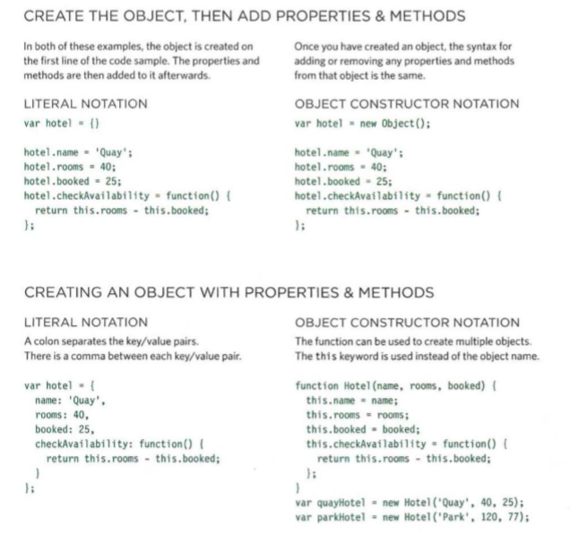

##Domain Modeling
**Domain modeling** is the process of creating a conceptual model in code for a specific problem. A model describes the various entities, their attributes and behaviors, as well as the constraints that govern the problem domain. An entity that stores data in properties and encapsulates behaviors in methods is commonly referred to as an object-oriented model.

A domain model that's articulated well can verify and validate the understanding of a specific problem among various stakeholders. As a communication tool, it defines a vocabulary that can be used within and between both technical and business teams. 

Domain modeling is the process of creating a conceptual model for a specific problem. And a domain model that's articulated well can verify and validate your understanding of that problem.

Here's some tips to follow when building your own domain models.

1. When modeling a single entity that'll have many instances, build self-contained objects with the same attributes and behaviors.
1. Model its attributes with a constructor function that defines and initializes properties.
1. Model its behaviors with small methods that focus on doing one job well.
1. Create instances using the new keyword followed by a call to a constructor function.
1. Store the newly created object in a variable so you can access its properties and methods from outside.
1. Use the this variable within methods so you can access the object's properties and methods from inside.  

##CREATING MANY OBJECTS: CONSTRUCTOR NOTATION 
Sometimes you will want several objects to represent similar things. Object constructors can use a function as a template for creating objects. First, create the template with the object's properties and methods. 
A function called Hotel will be used as a template for creating new objects that represent hotels. Like all functions, it contains statements. In this case, they add properties or methods to the object. 
The function has three parameters.  

##WAYS TO CREATE OBJECT
  

